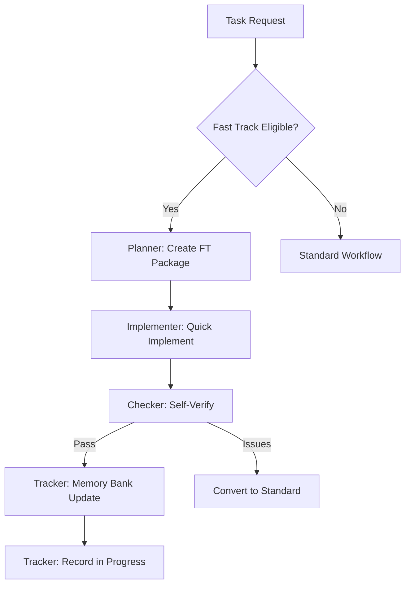

# Fast Track Protocol

Fast Track is a special operational mode for rapid, low-risk changes that bypass the full role workflow while maintaining Memory Bank integrity.

## Fast Track Eligibility
- Bug fixes <= 10 lines of code
- Documentation clarifications (no structural changes)
- Configuration tweaks (no behavior changes) 
- UI text/style updates (no functional changes)
- Test additions (no implementation changes)
- Single file scope
- No dependency changes
- No API changes
- No security implications

## Auto-Disqualification
- Multiple file changes required
- Architectural impact
- New dependencies
- API changes
- Security considerations
- State management changes
- Database schema changes

## Fast Track Package Format
```markdown
## Fast Track [FT-YYYYMMDD-XX]
- Status: [DRAFT|IN_PROGRESS|COMPLETED|CONVERTED]
- Change Type: [BUG_FIX|DOC_UPDATE|CONFIG|UI_TWEAK|TEST_ADD]
- Risk Level: [LOW|MEDIUM]
- Description: [concise description]
- Rationale: [why Fast Track is appropriate]
- Files Affected: [single file path]
- Line Impact: [number of lines changed]
- Implementation: [implementation details]
- Rollback Plan: [how to revert if needed]
- Memory Bank Updates:
  - [ ] versions.md
  - [ ] activeContext.md
  - [ ] progress.md
```

## Fast Track Workflow



## Memory Bank Updates for Fast Track

### progress.md Format
```markdown
## Fast Track Changes
- [FT-20230603-01] UI text update in login form
- [FT-20230603-02] Fixed typo in API docs
- [FT-20230603-03] ⚠️ Converted to [WP-20230603-01]

### Fast Track Metrics
- Total Completed: 12
- Conversion Rate: 2
- Average Time: 8m
- Success Rate: 92%
```

## Fast Track Safety Checklist
```markdown
## Fast Track Safety Check
1. Scope Verification
   - [ ] Meets all eligibility criteria
   - [ ] Single file impact confirmed
   - [ ] No hidden dependencies
   - [ ] Clear rollback path

2. Risk Assessment
   - [ ] No security implications
   - [ ] No data integrity risks
   - [ ] No performance impact
   - [ ] No API changes

3. Documentation Impact
   - [ ] Memory Bank updates identified
   - [ ] Cross-references checked
   - [ ] Version impact assessed
```

## Fast Track Status Flags
- `[FAST_TRACK]` - In Progress
- `[FT_SUCCESS]` - Completed
- `[FT_CONVERTED]` - Moved to standard
- `[FT_REVERTED]` - Rolled back

## Fast Track Conversion Protocol
When a Fast Track task needs to be converted to standard workflow:
1. Halt Fast Track implementation
2. Document findings and reasons for conversion
3. Create standard Work Package with existing work
4. Update progress.md with conversion notice
5. Transfer all documentation to new Work Package
6. Mark Fast Track as CONVERTED with link to new WP
7. Resume with standard workflow