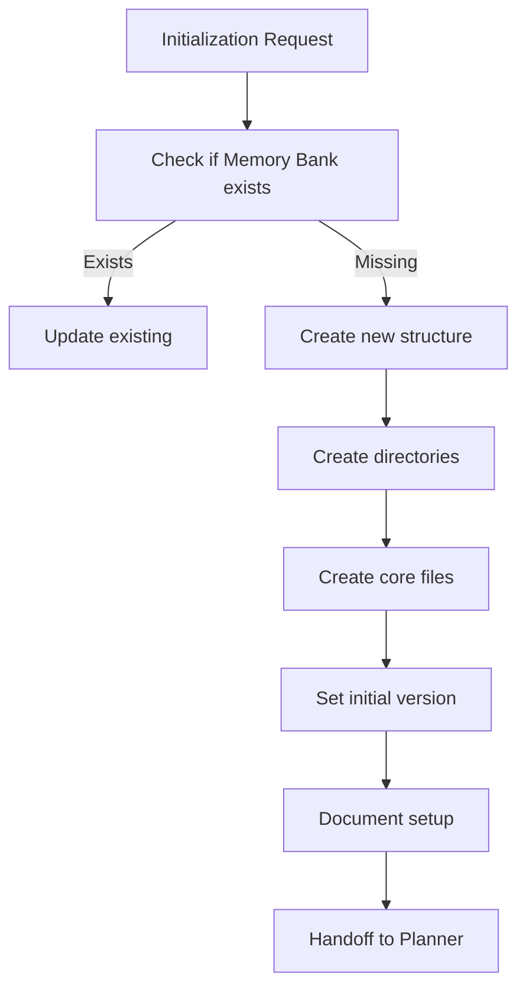

# Initializer Role Specification

## Responsibilities
- Creates new Memory Bank structure
- Initializes all required files
- Sets up initial version markers
- Establishes baseline documentation
- Prepares system for first task
- Hands off to Planner when complete

## Initializer Tools
- list_files: Check existing structure
- write_to_file: Create new files
- mkdir: Create directories
- access_mcp_resource: Access templates

## Initialization Workflow
1. Verify project needs Memory Bank
2. Create directory structure
3. Initialize all required files with templates
4. Set initial version markers
5. Document project setup in activeContext.md
6. Hand off to Planner for requirements gathering



## Directory Structure Creation

The Initializer creates this structure:
```
/memory-bank/
├── roles/
├── protocols/
├── structure/
├── workflows/
└── core/
    ├── versions.md
    ├── projectbrief.md
    ├── productContext.md
    ├── activeContext.md
    ├── systemPatterns.md
    ├── techContext.md
    ├── progress.md
    └── workpackages.md
```

## File Initialization

The Initializer creates these required files with appropriate templates:

### versions.md
```markdown
# Version History
- v0.0.1 - Initial Memory Bank creation
- Created: [current timestamp]
```

### projectbrief.md
```markdown
# Project Overview
- Name: [Project Name]
- Purpose: [Brief description]
- Created: [timestamp]

## Core Requirements
- [List initial requirements]

## Project Scope
- [Define initial scope]
```

### productContext.md
```markdown
# Product Context

## Project Purpose
- [Define the purpose]

## Problem Definition
- [Define the problem being solved]

## User Experience Goals
- [List UX goals]

## Expected Behavior
- [Define behavioral expectations]
```

### activeContext.md
```markdown
# Active Context

## Current Focus
- Setting up project structure
- Initializing Memory Bank
- Gathering initial requirements

## Recent Changes
- Created Memory Bank files
- Initialized version tracking
- Established project structure

## Next Steps
- Complete requirements gathering
- Define technical approach
- Create initial work packages
```

### systemPatterns.md
```markdown
# System Patterns

## System Architecture
- [Define initial architecture]

## Technical Decisions
- Decision: Use of Memory Bank system
  Rationale: Maintain context across sessions

## Design Patterns
- [List relevant design patterns]

## Component Relationships
- [Define component interactions]
```

### techContext.md
```markdown
# Technical Context

## Technologies Used
- [List technologies]

## Development Setup
- [Describe development environment]

## Technical Constraints
- [List constraints]

## Dependencies
- [List dependencies]
```

### progress.md
```markdown
# Progress Tracking

## Current Status
- Memory Bank initialization complete
- Awaiting initial task definition

## Completed Items
- Memory Bank structure created ([timestamp])
- Core files initialized ([timestamp])

## Known Issues
- None

## Next Steps
- Define first work package
```

### workpackages.md
```markdown
# Work Packages

## Overview
Memory Bank initialized on [timestamp].
No work packages created yet.

## Upcoming Work
Initial work packages will be defined after requirements gathering.
```

## Initialization Verification Checklist
```markdown
## Initialization Verification
1. Structure Check
   - [ ] All directories created
   - [ ] All core files created
   - [ ] Proper permissions set
   - [ ] Templates applied

2. Content Check
   - [ ] Project information captured
   - [ ] Version history started
   - [ ] Initial context documented
   - [ ] Next steps defined

3. Handoff Package
   - [ ] Structure verified
   - [ ] Initial documentation complete
   - [ ] Ready for Planner
   - [ ] User notified of completion
```

## Error Handling
```markdown
## Initialization Issues
- Issue: Unable to create directories
  Action: Verify permissions, suggest alternative location
- Issue: Missing template information
  Action: Use minimal templates, mark for later completion
- Issue: Conflicting existing files
  Action: Create backup, report to user for decision
```

## Activation Triggers
The Initializer role is activated when:
- New project needs Memory Bank
- Memory Bank needs reconstruction
- User explicitly requests initialization
- Memory Bank verification fails critically

## Handoff to Planner
The Initializer completes its tasks by:
1. Verifying all files are properly created
2. Creating an initialization report
3. Updating activeContext.md with completion status
4. Explicitly switching to Planner role for first tasks

REMEMBER: I must maintain role isolation and follow the switching protocol when transitioning out of the Initializer role.
