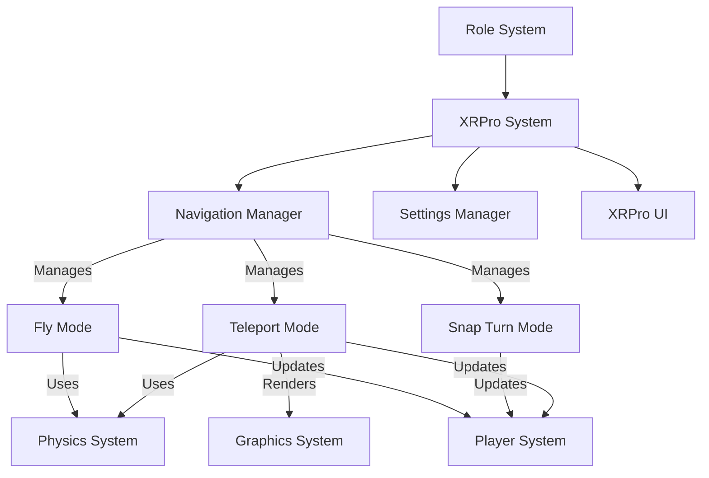
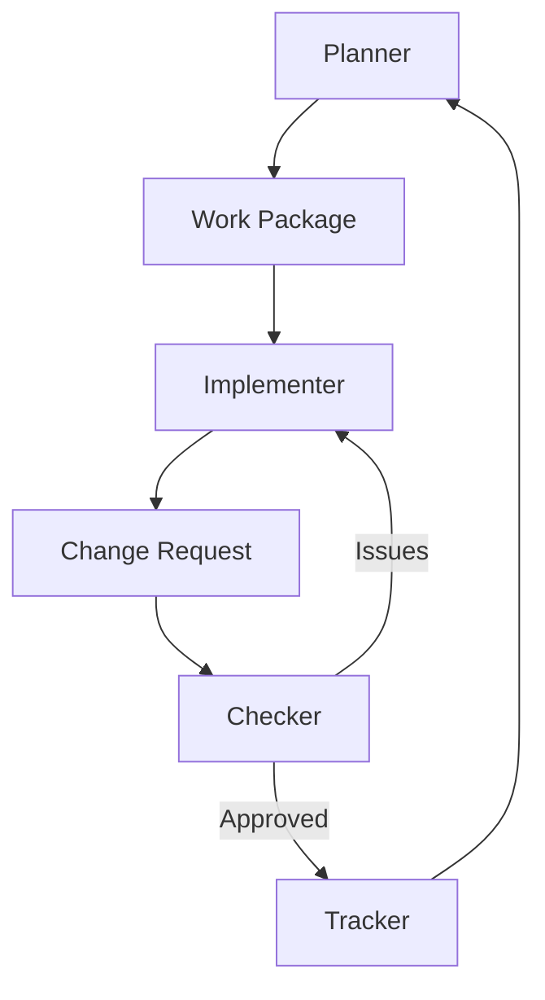
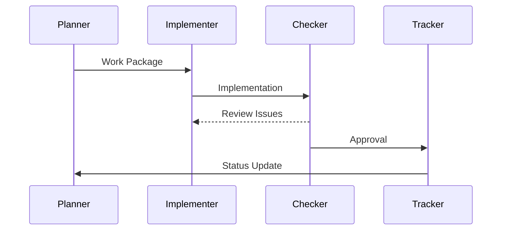
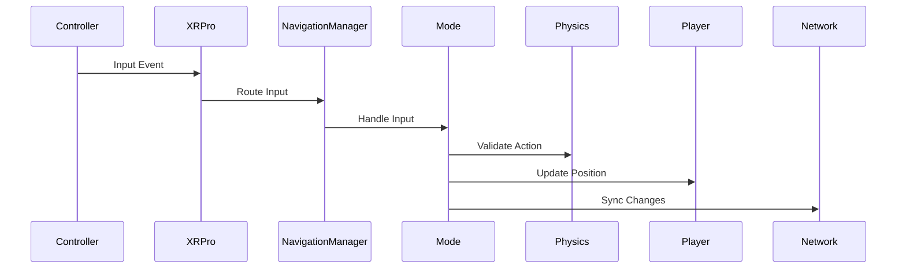
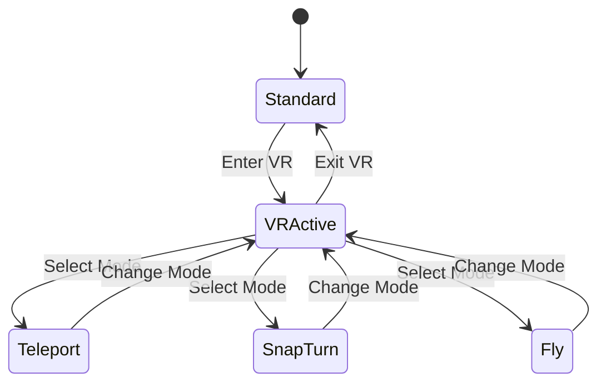

# WebXR Pro System Patterns

## System Architecture Overview

### Core Architecture


### Role System Architecture


## System Hierarchy

### 1. Role System Layer
- Manages development workflow
- Ensures documentation quality
- Maintains system integrity
- Coordinates between roles

### 2. XRPro System Layer
- Core system that replaces default XR
- Manages VR session lifecycle
- Coordinates between subsystems
- Handles settings persistence

### 3. Navigation Layer
Each mode follows a common pattern:
```javascript
class NavigationMode {
  constructor(manager) {
    this.manager = manager
    this.world = manager.world
  }

  activate() {
    // Setup mode-specific handlers
  }

  deactivate() {
    // Cleanup mode-specific state
  }

  update(delta) {
    // Mode-specific update logic
  }
}
```

### 4. Role Implementation Patterns

#### Planner Pattern
```javascript
class PlannerRole {
  async planTask() {
    const context = await this.readMemoryBank()
    const requirements = await this.analyzeRequirements()
    const workPackage = this.createWorkPackage(requirements)
    await this.validateWorkPackage(workPackage)
    return workPackage
  }
}
```

#### Implementer Pattern
```javascript
class ImplementerRole {
  async implementTask(workPackage) {
    await this.validateRequirements(workPackage)
    const changes = await this.makeChanges(workPackage)
    const docs = await this.updateDocumentation(changes)
    return { changes, docs }
  }
}
```

#### Checker Pattern
```javascript
class CheckerRole {
  async verifyImplementation(changes, workPackage) {
    const validationResult = await this.validateChanges(changes)
    const docsResult = await this.verifyDocumentation()
    return this.generateReport(validationResult, docsResult)
  }
}
```

#### Tracker Pattern
```javascript
class TrackerRole {
  async updateStatus(verificationReport) {
    await this.updateProgress(verificationReport)
    await this.updateVersions()
    await this.validateCrossReferences()
    await this.notifyPlanner()
  }
}
```

### 5. Supporting Systems

#### Role Support Systems
- Work Package Manager
- Verification System
- Documentation Manager
- Status Tracking System

#### XR Support Systems
- Settings Manager
- UI System
- Comfort Controls

## System Patterns

### 1. Role Communication Pattern


### 2. Development Communication Pattern


### 2. State Management


## Implementation Guidelines

### 1. Mode Implementation
- Each mode is self-contained
- Consistent interface across modes
- Clear activation/deactivation
- Standardized input handling

### 2. Physics Integration
- Batched raycasts for performance
- Surface validation
- Collision detection
- Movement constraints

### 3. Network Synchronization
- Optimized update packets
- Position interpolation
- State synchronization
- Error correction

### 4. UI Integration
- VR-space rendering
- Mode feedback
- Comfort settings
- Visual indicators

## Extension Points

### 1. New Navigation Modes
- Implement NavigationMode interface
- Register with NavigationManager
- Add mode-specific settings
- Integrate with physics/player systems

### 2. Custom Visualizations
- Extend base visualization system
- Add mode-specific feedback
- Implement custom shaders
- Optimize for VR

### 3. Settings Extensions
- Add mode-specific settings
- Implement validation
- Handle persistence
- Provide defaults
