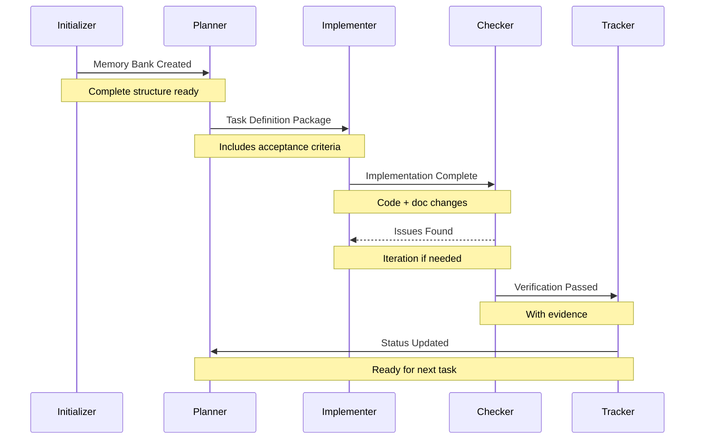
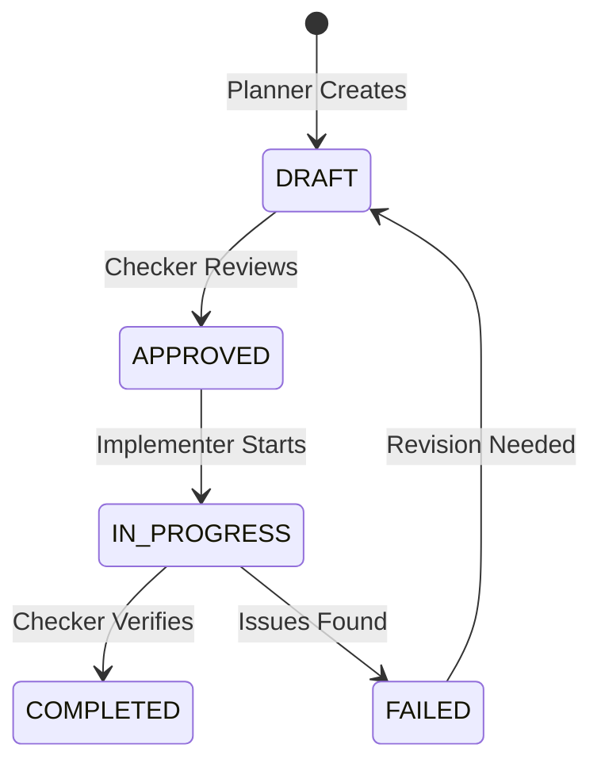
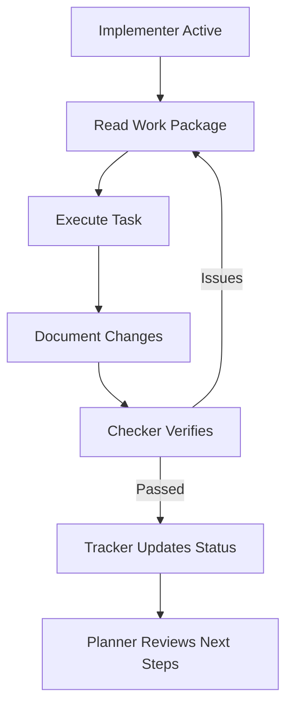
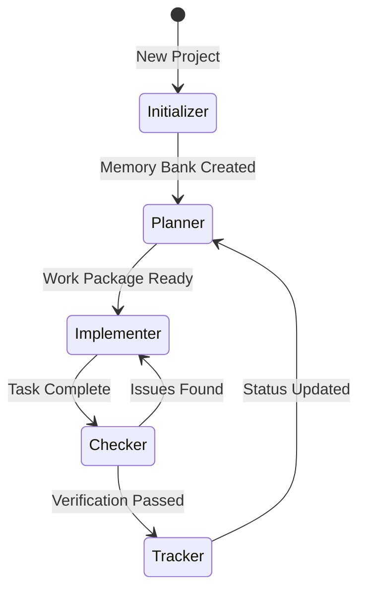
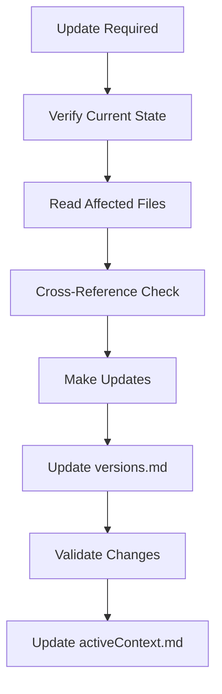
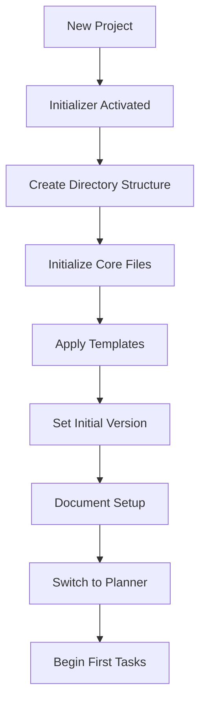

# Cross-Role Workflows

This document captures workflows that span multiple roles to provide a cohesive view of integrated processes.

## Role Interaction Protocol

## Work Package Lifecycle

## Act Mode Operation

In Act Mode:
1. **Implementer**
   - Reviews work package
   - Executes defined tasks
   - Documents changes
   - Creates verification evidence

2. **Checker**
   - Validates against acceptance criteria
   - Reviews documentation updates
   - Verifies Memory Bank consistency
   - Reports verification results

3. **Tracker**
   - Updates progress status
   - Records completed tasks
   - Updates version history
   - Maintains cross-references

4. **Planner**
   - Reviews completion
   - Plans next steps
   - Adjusts task sequence if needed
   - Updates project timeline

## Transition Protocol

## Update Sequence

## Synchronization Triggers

MUST verify and update Memory Bank when:
1. Starting any task
2. Completing any step
3. Updating status
4. Switching modes
5. Creating/modifying files
6. Marking items complete
7. Recording decisions
8. Handling async operations

## Memory Bank Initialization Flow

